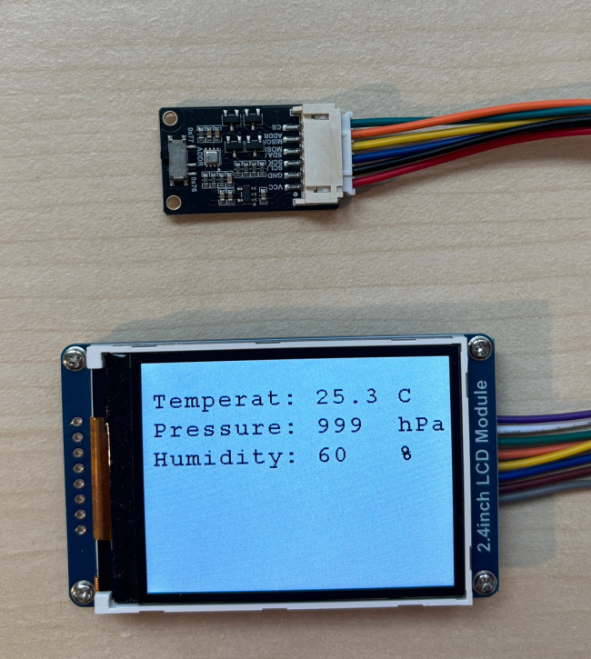
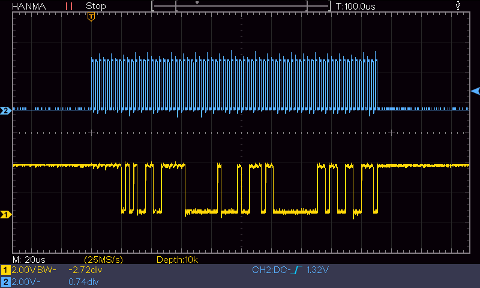
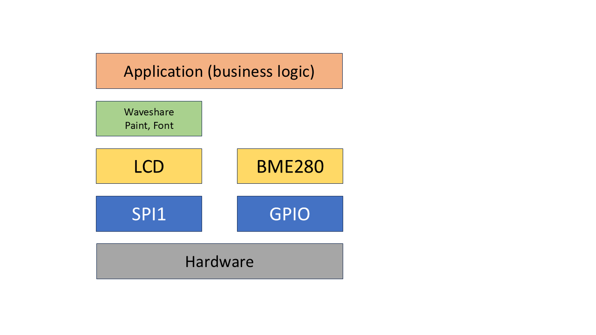
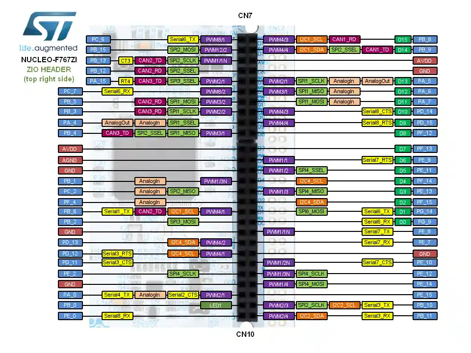
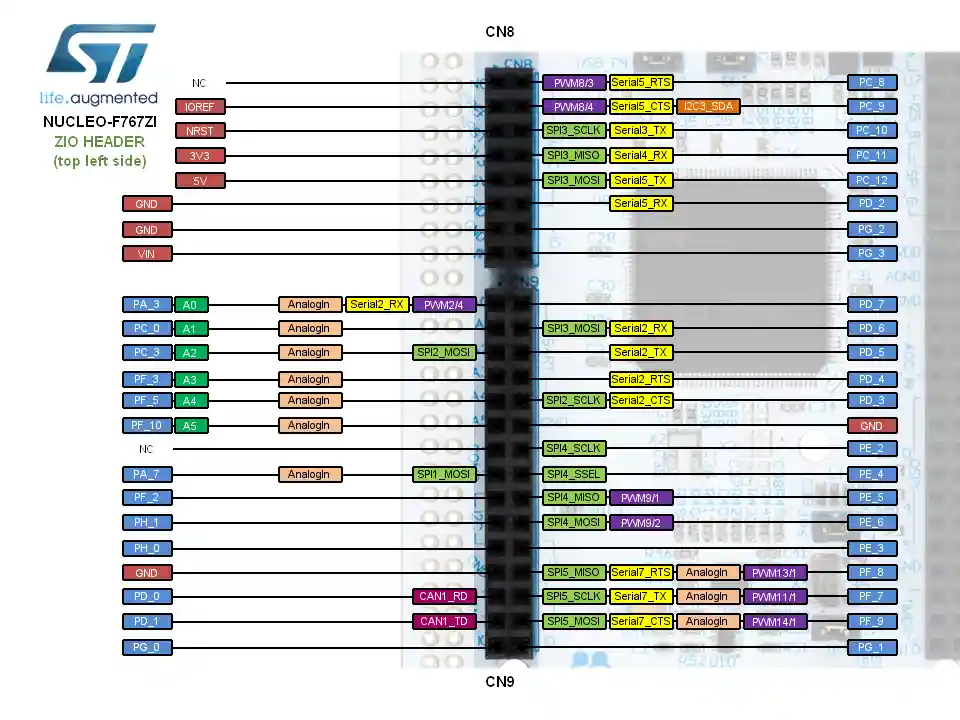

BME280 data (temperature, air pressure and humidity) displayed on the Waveshare ILI9341 LCD by STM32F767ZI (dev board) bare metal (no HAL) using the CubeIDE.

BME280 and 2.4" LCD

| LCD      | Port     | Function     |
|----------|----------|------------- |
| VCC      | 3,3V     | Vcc          |
| GND      | GND      | GND          |
| DIN      | PA7      | SPI1_MOSI    |
| CLK      | PA5      | SPI1_CLK     |
| CS       | PB6      | Chip Select  |
| DC       | PA0      | Data/Command |
| RST      | PB9      | Reset        |
| BL       | -        | Backlight    |

| BME280   | Port     | Function     |
|----------|----------|--------------|
| VCC      | 3,3V     | Vcc          |
| GND      | GND      | GND          |
| SCK      | PA5      | SPI1_CLK     |
| MOSI     | PA7      | SPI1_MOSI    |
| MISO     | PA6      | SPI1_MISO    |
| CS       | PC0      | Chip Select  |

BME280 raw data burst via SPI

Software architecture

Hardware
BME280: https://seengreat.com/product/207/bme280-environmental-sensor?srsltid=AfmBOorvlymsT9w0Ea-JBnftBbgADYcXMKpadnPHUyHl7X1wOO5TTgUa

LCD: https://www.waveshare.com/wiki/2.4inch_LCD_Module?srsltid=AfmBOoqtv3bq-mZfPtsi2BxiewwQnIkomXrloIzpVwGw_HnrOcmvQZar

Nucleo-STM32767ZI: https://www.st.com/en/evaluation-tools/nucleo-f767zi.html

Video: https://youtube.com/shorts/LbtwaH8bDvs?si=J_LBT7NFOr57htwr

